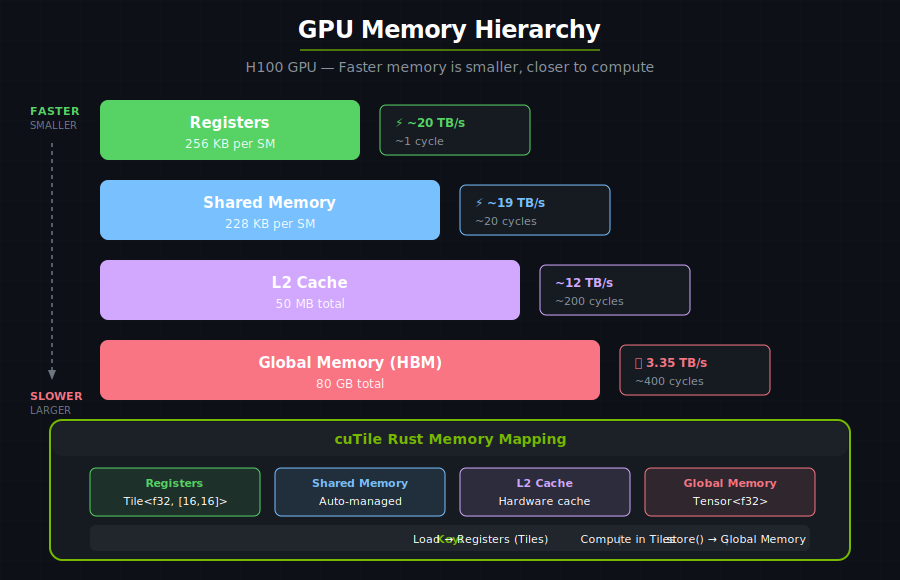
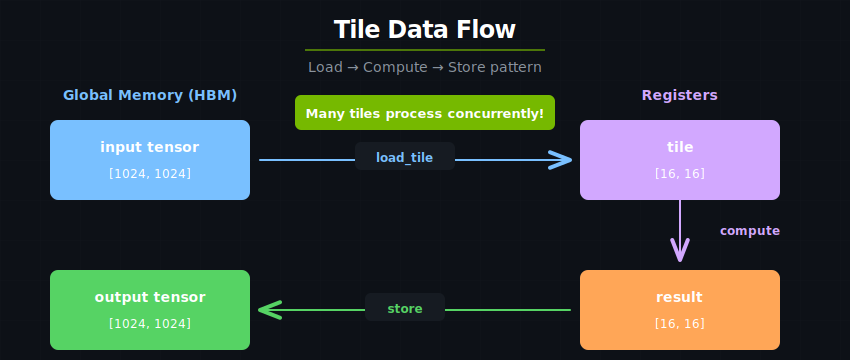

# Memory Hierarchy

Understanding GPU memory is essential for writing fast kernels. The key insight: **data locality determines performance**.

## The Memory Pyramid

Modern NVIDIA GPUs (H100 shown) have a multi-level memory hierarchy:



## Memory Types in Detail

### Global Memory (HBM)

- **What**: High Bandwidth Memory, the GPU's main memory
- **Size**: Varies by GPU model (e.g., 80 GB on H100)
- **Bandwidth**: High bandwidth (e.g., 3 TB/s on H100 SXM5) but highest latency of any memory level
- **Latency**: ~400 cycles
- **Access**: All tile blocks can access all locations

```rust
// Tensors live in global memory
let x: Arc<Tensor<f32>> = ones([1024, 1024]).arc().sync_on(&stream)?;
```

**Best practices:**
- Coalesce memory accesses (adjacent threads access adjacent memory)
- Minimize global memory round-trips
- Load once, use many times

### L2 Cache

- **What**: Hardware-managed cache between HBM and SMs
- **Size**: ~50 MB (H100)
- **Bandwidth**: Several times faster than HBM
- **Latency**: ~200 cycles

**cuTile Rust automatically benefits from L2** when you:
- Reuse data across tiles
- Access memory in predictable patterns
- Keep working sets small

### Shared Memory (SMEM)

- **What**: Fast on-chip memory shared among all threads within a tile block
- **Size**: Up to 228 KB per SM (H100)
- **Bandwidth**: Much faster than L2
- **Latency**: ~20 cycles
- **Scope**: Shared within a tile block

:::{note}
In the tile programming model, **you never manage shared memory directly**. You simply load from and store to global memory (HBM) using tensors, and the underlying [Tile IR](https://docs.nvidia.com/cuda/tile-ir/latest/) compiler and runtime handle the mapping onto hardware resources — including shared memory, threads, and Tensor Cores — automatically. This is a key advantage of the tile-based abstraction over traditional CUDA programming, where shared memory management is a significant source of complexity and bugs.
:::

### Registers (RMEM)

- **What**: Fastest storage on the GPU, private to each thread within a tile block
- **Size**: 256 KB per SM (64K 32-bit registers on H100)
- **Bandwidth**: Fastest (near-zero latency)
- **Latency**: ~1 cycle
- **Scope**: Private to each thread within a tile block

**In cuTile Rust, `Tile<E, S>` data lives in registers during computation.** You load data from global memory (HBM) into tiles, compute on tiles, and store results back:

```rust
let tile: Tile<f32, {[16, 16]}> = load_tile_like_2d(input, output);
// 'tile' lives in registers — loaded from HBM, computed on in registers
```

---

## Data Movement in cuTile Rust

### The Load/Store Pattern

The fundamental pattern is:
1. **Load** from global memory (HBM) into tiles
2. **Compute** on tiles
3. **Store** results back to global memory (HBM)

You only interact with global memory (HBM) — the [Tile IR](https://docs.nvidia.com/cuda/tile-ir/latest/) runtime decides how to map your tiles onto the hardware memory hierarchy (registers, shared memory, caches) for optimal performance.

```rust
#[cutile::entry()]
fn kernel(output: &mut Tensor<f32, S>, input: &Tensor<f32, {[-1, -1]}>) {
    // 1. Load: HBM → Tile
    let tile = load_tile_like_2d(input, output);
    
    // 2. Compute on tile
    let result = tile * 2.0 + 1.0;
    
    // 3. Store: Tile → HBM
    output.store(result);
}
```



### Partitioning for Tiled Access

Partitioning logically divides a tensor into a grid of equally sized sub-regions, each processed by one tile block:

```rust
// 1024×1024 tensor, processed as 16×16 tiles
let output = zeros([1024, 1024])
    .partition([16, 16]);  // Creates 64×64 = 4096 tiles

// Each tile knows its position
// Tile (i, j) processes output[i*16:(i+1)*16, j*16:(j+1)*16]
```

---

## Memory Access Patterns

### Coalesced Access (Good)

When the underlying threads within a tile block access adjacent memory locations, the hardware can combine these into a single wide memory transaction:

```text
Thread 0: memory[0]
Thread 1: memory[1]
Thread 2: memory[2]
...
Thread 31: memory[31]

→ Single 128-byte transaction! Efficient!
```

cuTile Rust's tile load operations automatically generate coalesced access patterns — the compiler maps tile elements to threads in a way that maximizes memory throughput. This is one of the key advantages of the tile programming model: you choose tile shapes and access patterns, and the compiler handles the thread-level memory coalescing.

### Strided Access (Avoid)

When threads access memory with large gaps between addresses, each access becomes a separate transaction:

```text
Thread 0: memory[0]
Thread 1: memory[1024]
Thread 2: memory[2048]
...

→ Many separate transactions! Slow!
```

:::{warning}
Strided access can reduce effective bandwidth by 32x or more. Use tile operations and row-major access patterns to maintain coalesced access.
:::

---

## Data Reuse Strategies

### Strategy 1: Tile Reuse

Load data once, use multiple times:

```rust
fn gemm_tile<const BM: i32, const BN: i32, const BK: i32, const K: i32>(
    z: &mut Tensor<f32, {[BM, BN]}>,
    x: &Tensor<f32, {[-1, K]}>,
    y: &Tensor<f32, {[K, -1]}>,
) {
    let mut acc = load_tile_mut(z);
    
    for i in 0..(K / BK) {
        let tile_x = x.partition(const_shape![BM, BK]).load([pid.0, i]);
        let tile_y = y.partition(const_shape![BK, BN]).load([i, pid.1]);
        
        // tile_x and tile_y are loaded once, used for BM×BN×BK operations
        acc = mma(tile_x, tile_y, acc);
    }
    
    z.store(acc);
}
```

**Arithmetic intensity** = Operations / Memory Access

Higher is better! The tiled GEMM above achieves ~O(BK) reuse per loaded element.

### Strategy 2: Partition Wisely

Choose partition sizes that:
1. Are not too large (the runtime needs to map tiles onto finite hardware resources)
2. Maximize reuse (not too small)
3. Are powers of 2 or multiples of common hardware widths

```rust
// Good: Powers of 2, reasonable size
.partition([64, 64])   // 4096 elements per tile
.partition([128, 32])  // 4096 elements per tile

// Bad: Too small (overhead dominates)
.partition([4, 4])     // Only 16 elements per tile

// Bad: Too large (may spill to slower memory)
.partition([512, 512]) // 262144 elements per tile
```

---

## Memory-Bound vs Compute-Bound

### Memory-Bound Kernels

Limited by memory bandwidth, not compute:

```rust
// Element-wise add: 3 memory ops, 1 compute op
fn add<const S: [i32; 2]>(
    z: &mut Tensor<f32, S>,
    x: &Tensor<f32, {[-1, -1]}>,
    y: &Tensor<f32, {[-1, -1]}>
) {
    let tx = load_tile_like_2d(x, z);  // 1 read
    let ty = load_tile_like_2d(y, z);  // 1 read
    z.store(tx + ty);                  // 1 write, 1 add
}
// Arithmetic intensity: 1 FLOP / 12 bytes = 0.08 FLOPS/byte
```

### Compute-Bound Kernels

Limited by compute throughput:

```rust
// Matrix multiply: O(N³) compute, O(N²) memory
fn gemm<E: ElementType, const BM: i32, const BN: i32, const BK: i32, const K: i32>(
    z: &mut Tensor<E, { [BM, BN] }>,
    x: &Tensor<E, { [-1, K] }>,
    y: &Tensor<E, { [K, -1] }>,
) {
    // ... tiled implementation with K-loop
}
// Arithmetic intensity: O(N) FLOPS/byte for large N
```

**Goal**: Make kernels compute-bound by maximizing data reuse.

---

## Summary

| Memory Level | Size | Latency | Use For |
|-------------|------|---------|---------|
| Registers | 256KB/SM | ~1 cycle | Active computation |
| Shared Mem | 228KB/SM | ~20 cycles | Block-level sharing |
| L2 Cache | ~50 MB | ~200 cycles | Automatic caching |
| HBM | Varies by GPU | ~400 cycles | Large data storage |

**Key takeaways:**
1. You only load from and store to HBM — the [Tile IR](https://docs.nvidia.com/cuda/tile-ir/latest/) runtime manages the rest of the memory hierarchy for you
2. Load once, use many times (maximize arithmetic intensity)
3. Access memory in coalesced patterns (tile operations do this automatically)
4. Choose partition sizes wisely

---

Continue to [Operations](operations.md) to see what you can do with tiles.
