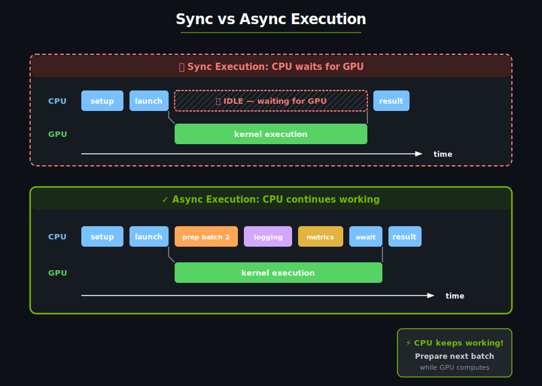

# Tutorial 7: Intro to Async Execution

> Note: While async concepts are taught using the `tokio` runtime, any async runtime can be used.

The sync API blocks the CPU until the GPU finishes:

```rust
let launcher = hello_world_kernel();
launcher.grid((2, 2, 1)).sync_on(&stream);  // CPU waits here!
// CPU blocked until GPU finishes
```



With async, the CPU can do other work while the GPU computes:

- Preparing the next batch while the current one computes.
- Pipelining multiple operations.
- Overlapping data transfer with computation.
- Multi-GPU coordination.

---

## DeviceOperation

In cutile, GPU work is represented as a `DeviceOperation` — a description of work to be done, not yet executed:

- `DeviceOperation` describes the work.
- `.await`, `tokio::spawn(.)`, or `.sync_on(.)` executes it.

```rust
// This creates a DeviceOperation, but doesn't execute yet!
let tensor_op = api::ones([1024, 1024]);  // Returns impl DeviceOperation

// Nothing has happened on the GPU yet...

// NOW it executes:
let tensor: Tensor<f32> = tensor_op.sync_on(&stream);  // Sync API
// or
let tensor: Tensor<f32> = tensor_op.await;             // Async API
```

---

## Sync vs Async APIs

In cutile, a `DeviceOperation` can be executed with either sync or async APIs. Given a particular operation `op`:

| API | Description |
|----------|-------------|
| `op.sync()` | Immediately executes `op` on the default GPU device (device 0). Blocking. Callable outside of async context. |
| `op.sync_on(&stream)` | Immediately executes `op` on `stream`. Blocking. Callable outside of async context. |
| `op.await` | Immediately executes `op` as part of the async context from which it is invoked. Blocks the enclosing async context but frees the executing thread, allowing the runtime to schedule other tasks on it. Can only be called from within an async context. |
| `tokio::spawn(op)` | Submits a task to the async runtime, returning a handle that can later be awaited. Non-blocking. Can only be called from within an async context. |

> Note: An async context is any code appearing in a block defined with the `async` keyword, e.g. `async fn ...`, `async { ... }`, `async || { ... }`.

---

## Async Vector Addition

```rust
use cutile::api::{ones, zeros};
use cutile::tensor::{Tensor, ToHostVec, Unpartition};
use cutile::tile_kernel::{IntoDeviceOperationPartition, TileKernel, TensorDeviceOpToHostVec};
use cuda_async::device_operation::*;
use std::sync::Arc;

#[cutile::module]
mod async_add_module {
    use cutile::core::*;

    #[cutile::entry()]
    fn add<const S: [i32; 2]>(
        z: &mut Tensor<f32, S>,
        x: &Tensor<f32, {[-1, -1]}>,
        y: &Tensor<f32, {[-1, -1]}>
    ) {
        let tile_x = load_tile_like_2d(x, z);
        let tile_y = load_tile_like_2d(y, z);
        z.store(tile_x + tile_y);
    }
}

use async_add_module::add_apply;

#[tokio::main]
async fn main() {
    let x: Arc<Tensor<f32>> = ones([32, 32]).arc().await?;
    let y: Arc<Tensor<f32>> = ones([32, 32]).arc().await?;

    let z_op = zeros::<2, f32>([32, 32]);
    let args = zip!(
        z_op.partition([4, 4]),           // Output, partitioned into tiles
        x.device_operation(),             // Input x as DeviceOperation
        y.device_operation()              // Input y as DeviceOperation
    );
    let (z, _x, _y) = args.apply(add_apply).unzip();

    let z_host: Vec<f32> = z.unpartition().to_host_vec().await?;
    println!("z[0] = {} (expected 2.0)", z_host[0]);
}
```

**Output:**

```text
z[0] = 2 (expected 2.0)
```

---

## Overlapping Work with Spawn

`.await` lets the programmer control *when* to execute work, but it blocks the enclosing async context — no further code in that `async` block runs until the awaited operation completes. (The underlying thread is freed and can run other tasks in the meantime, but *this* async context is suspended.) `tokio::spawn` converts a future into a concurrently executing *task*, returning a non-blocking handle that can later be awaited to retrieve the result.

```rust
#[tokio::main]
async fn main() {
    let batch1_op = prepare_batch(1);  // Returns DeviceOperation
    let batch2_op = prepare_batch(2);  // Returns DeviceOperation

    let batch1 = batch1_op.await;

    let result1_op = process_kernel(batch1);
    let result1_handle = tokio::spawn(result1_op);  // Non-blocking

    // batch 2 data can be prepared while batch 1's kernel runs
    let batch2 = batch2_op.await;

    let result2 = process_kernel(batch2).await;

    let result1 = result1_handle.await;
}
```

---

## Composing DeviceOperations

### `zip!` — Combine Operations for Kernels

`zip!` combines multiple DeviceOperations into a tuple that can be passed to kernels:

```rust
use cuda_async::device_operation::*;

let args = zip!(
    output_op.partition([4, 4]),   // Partitioned output
    input1.device_operation(),     // Input as DeviceOperation
    input2.device_operation()      // Another input
);

let (out, _in1, _in2) = args.apply(kernel_apply).unzip();
```

### `apply` — Run Kernels on DeviceOperations

```rust
let args = zip!(output_op, input_op);
let (output, _input) = args.apply(some_kernel_apply).unzip();

let result = output.await;
```

Use `kernel_op(...)` instead when the arguments are still separate `DeviceOperation`s rather than already grouped with `zip!`:

```rust
let output_op = kernel_op(z_op, input_op);
let output = output_op.await;
```

---

## When to Use Async

| Scenario | Use Sync | Use Async |
|----------|----------|-----------|
| Simple scripts | ✓ | |
| Interactive exploration | ✓ | |
| Production pipelines | | ✓ |
| Multi-batch processing | | ✓ |
| Multi-GPU workloads | | ✓ |
| Overlapping compute/transfer | | ✓ |

Start with sync for learning, move to async for production.

---

## Key Takeaways

| Concept | What It Means |
|---------|---------------|
| **DeviceOperation** | A description of GPU work, not yet executed |
| **.await** | Execute the operation and get the result |
| **Async enables overlap** | CPU can do work while GPU computes |
| **zip!** | Combine multiple operations for kernel input |
| **apply** | Launch a kernel from one grouped `DeviceOperation` |
| **`*_op`** | Launch a kernel from separate `DeviceOperation` arguments |

---

### Exercise 1: Async SAXPY

Convert the SAXPY kernel to use the async API.

### Exercise 2: Parallel Tensor Creation

Use `zip!` to create 4 tensors in parallel.

:::{dropdown} Answer
```rust
let (a, b, c, d) = zip!(
    ones([100, 100]).arc(),
    zeros([100, 100]).arc(),
    randn(0.0, 1.0, [100, 100]).arc(),
    arange(10000).arc()
).await?;
```
:::

### Exercise 3: Measure the Difference

Time a sync version vs. an async version with overlapped work. Use `std::time::Instant` to measure.
